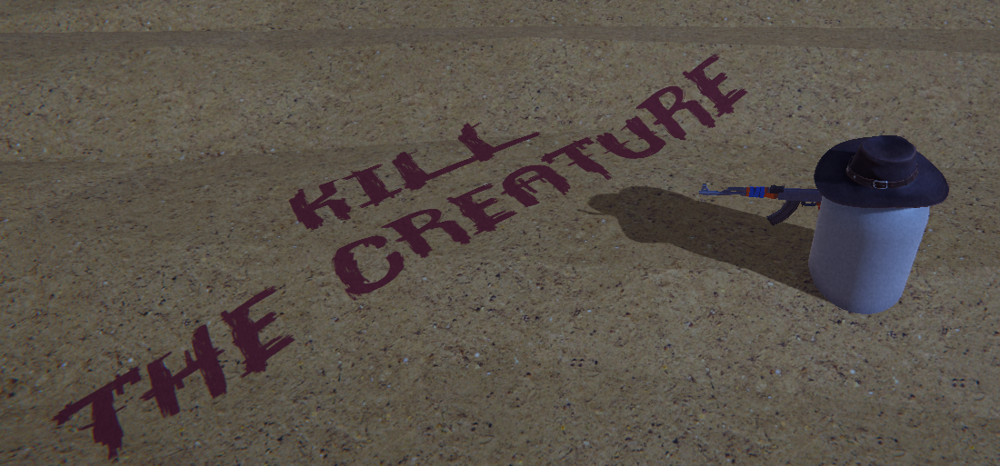

Strange Presence
===

A rogue-lite shoother action game with a modular wave & upgrades system that was born in a game jam.



***Upgrade System***


A dynamic upgrade system with highly decoupled, easy to expand code.

```c#
using UnityEngine;

namespace Upgrades
{
    public abstract class Upgrade : ScriptableObject
    {
        public string[] upgradeNames;
        public string description;
        public bool isUnique;
    
        public abstract void ApplyUpgrade(GameObject target, RarityHelper.Rarity rarity);
        public int[] multipliers;
    }
}

```
All we have to do is to create a child class and fill ApplyUpgrade with custom logic for a new upgrade.

```c#
using UnityEngine;

namespace Upgrades
{
    [CreateAssetMenu(fileName = "New Upgrade", menuName = "Upgrades/FireRateUpgrade")]
    public class FireRateUpgrade : Upgrade
    {
        public override void ApplyUpgrade(GameObject target, RarityHelper.Rarity rarity)
        {
            var weapon = target.GetComponentInChildren<Weapon>();
            if (weapon != null) weapon.fireRate +=  multipliers[(int)rarity] * 0.01f * weapon.fireRate;
            else Debug.LogError("FireRateUpgrade can only be applied to Weapon");
        }
    }
}
```
And just like that, we have everything accessible in the inspector to quickly test.


***Wave System***

WIP
